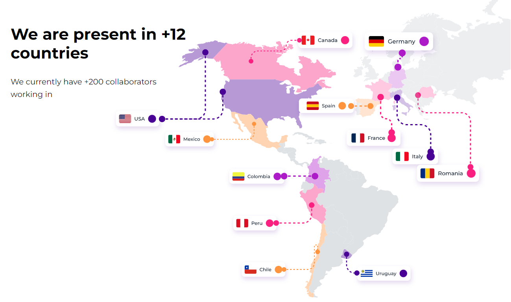

## Componente Countries.



El componente Countries muestra una lista de países junto con sus respectivas banderas, y los sitúa en su correspondiente continente dentro de un mapa.

## Propiedades

La interfaz countriesItem tiene dos propiedades:

| Propiedad | Tipo                     | Descripción                                                                                                                                                         |
| --------- | ------------------------ | ------------------------------------------------------------------------------------------------------------------------------------------------------------------- |
| `data`    | `Array<countriesObject>` | Un objeto que almacena información de un país, incluyendo su nombre, así como las rutas de los diferentes conectores y banderas adaptadas para todas las pantallas. |
| `FlagUSa` | `FlagUSa`                | Un objeto que contiene las rutas de los distintos conectores y banderas asociados a Estados Unidos, adaptados para ser utilizados en diferentes pantallas.          |

### Propiedades de countriesObject

| Propiedad      | Descripción                                           | Tipo   |
| -------------- | ----------------------------------------------------- | ------ |
| name           | Nombre del país y como indentificador de la clase     | string |
| FlagSpanish    | Ruta de la bandera del país en español                | string |
| FlagEnglish    | Ruta de la bandera del país en inglés                 | string |
| FlagMobile     | Ruta de la bandera del país para dispositivos móviles | string |
| ConectorMobile | Ruta del conector del país para dispositivos móviles  | string |
| Conector       | Ruta del conector del país                            | string |

### FlagUsa Component

El componente FlagUsa es un hijo del componente Countries que se utiliza para mostrar la bandera y los conectores de Estados Unidos. Debido a una particularidad en el diseño para este país, no se puede utilizar el mismo enfoque que se usa para otros países. En el caso de Estados Unidos, se requiere un conector específico para pantallas en tablet.

### Propiedades de FlagUSa

| Propiedad                   | Descripción                                                    | Tipo   |
| --------------------------- | -------------------------------------------------------------- | ------ |
| estadosUnidosFlag           | Ruta de la bandera de Estados Unidos                           | string |
| estadosUnidosConector       | Ruta del conector de Estados Unidos                            | string |
| UsaFlagMobile               | Ruta de la bandera de Estados Unidos para dispositivos móviles | string |
| englishFlagUsa              | Ruta de la bandera de Estados Unidos en inglés                 | string |
| UsaConectorMobile           | Ruta del conector de Estados Unidos para dispositivos móviles  | string |
| estadosUnidosConectorTablet | Ruta del conector de Estados Unidos para tabletas              | string |

### Uso de FlagUSa

Para utilizar el componente FlagUsa, importa el componente y pásale las propiedades requeridas:

```jsx
import FlagUsa from './FlagUsa';

const ExampleComponent = () => {
  return (
    <FlagUsa
      englishFlagUsa='/ruta/imagen/ingles.png'
      estadosUnidosConector='/ruta/imagen/conector.png'
      estadosUnidosConectorTablet='/ruta/imagen/conector-tablet.png'
      estadosUnidosFlag='/ruta/imagen/espanol.png'
      UsaConectorMobile='/ruta/imagen/conector-mobile.png'
      UsaFlagMobile='/ruta/imagen/flag-mobile.png'
    />
  );
};
```

### Como modificar FlagUSa

Si deseas modificar las propiedades del componente FlagUsa, lo puede hacer desde el archivo data.ts ubicado en la ruta assets/img/Countries/data.ts, puedes hacerlo de la siguiente manera:

En el archivo data.ts donde exportas las propiedades del componente FlagUsa (usaFlag), puedes modificar los valores de las propiedades en el arreglo usaFlag según tus necesidades. Aquí tienes un ejemplo de cómo hacerlo:

```jsx
export const usaFlag = {
  estadosUnidosFlag: 'nueva-ruta-de-la-bandera',
  estadosUnidosConector: 'nueva-ruta-del-conector',
  UsaFlagMobile: 'nueva-ruta-de-la-bandera-mobile',
  englishFlagUsa: 'nueva-ruta-de-la-bandera-en-ingles',
  UsaConectorMobile: 'nueva-ruta-del-conector-mobile',
  estadosUnidosConectorTablet: 'nueva-ruta-del-conector-para-tablet',
};
```

Simplemente modifica los valores de las propiedades según las rutas o valores que deseas asignar. Luego, al importar el objeto usaFlag en el componente donde utilizas FlagUsa, los nuevos valores se aplicarán automáticame nte.

### Modo de cambiar la posición de la banderas de estados unidos en el componente "FlagUSa"

Para modificar las posiciones de las banderas y los conectores de Estados Unidos en el mapa, utiliza las siguientes clases predefinidas:

- estadosFlag: se utiliza para modificar la posición de la bandera de Estados Unidos en pantallas de escritorio.
- estadosUnidosFlagMobile: se utiliza para modificar la posición de la bandera de Estados Unidos en vistas de dispositivos móviles.
- usaFlag: se utiliza para modificar la posición de la bandera de Estados Unidos en inglés en pantallas de escritorio.
- estadosConector: se utiliza para modificar la posición del conector en pantallas de escritorio.
- usaConectorMobile: se utiliza para modificar la posición del conector en vistas de dispositivos móviles.
- estadosConector2 : se utiliza para modificar la posición del conector en pantallas de tablet.

## Modo de uso de countries.

```js
import { Countries } from './path/to/Countries';
import countriesData from './path/to/countriesData';

const App = () => {
  return (
    <div>
      <Countries data={countriesData} flagUSa={usaFlag} />
    </div>
  );
};

export default App;
```

## Agregar o modificar un país

Para agregar y modificar un país en el componente `Countries`, debes seguir los siguientes pasos:

1. En el archivo data.ts ubicado en la ruta assets/img/Countries/data.ts, busca el arreglo de datos llamado `countries` que contiene la información de los países existentes.

2. Para agregar un nuevo país, agrega un nuevo objeto al arreglo `countries` con la siguiente estructura:

```javascript
{
  name: 'nombre_del_pais',
  FlagSpanish: 'ruta_de_la_bandera_en_español',
  FlagEnglish: 'ruta_de_la_bandera_en_inglés',
  FlagMobile: 'ruta_de_la_bandera_para_dispositivos_móviles',
  ConectorMobile: 'ruta_del_conector_para_dispositivos_móviles',
  Conector: 'ruta_del_conector'
}
```

Reemplaza 'nombre_del_pais' con el nombre del país que deseas agregar y proporciona las rutas correctas de las imágenes de la bandera y los conectores tanto para las versiones en español como en inglés. Asegúrate de incluir la ruta de la bandera para dispositivos móviles y el conector para dispositivos móviles.

3. Para modificar un país existente, busca el objeto correspondiente al país que deseas modificar en el arreglo countries y actualiza la información según tus necesidades.

4. Asegúrate de proporcionar las rutas de importación correctas para las imágenes de las banderas y los conectores del nuevo país.

Una vez que hayas agregado o modificado un país en el arreglo countries, el componente Countries mostrará automáticamente la nueva información cuando se vuelva a renderizar.

## Modo de cambiar la posición de las banderas en el componente "countries"

Para modificar las posiciones de las banderas y los conectores en el mapa, debes utilizar las clases predefinidas siguientes:

- {nombre del país}Flag: se utiliza para modificar la posición de la bandera en pantallas de escritorio. Ejemplo: canadaFlag.
- {nombre del país}FlagMobile: se utiliza para modificar la posición de la bandera en vistas de dispositivos móviles. Ejemplo: canadaFlagMobile.
- {nombre del país}Conector: se utiliza para modificar la posición del conector en pantallas de escritorio. Ejemplo: canadaConector.
- {nombre del país}ConectorMobile: se utiliza para modificar la posición del conector en vistas de dispositivos móviles. Ejemplo: canadaConectorMobile.

`Nota`: Asegúrate de que el nombre del país sea el mismo que se utiliza en la propiedad "name" del objeto "countriesObject". Si los nombres no coinciden, la clase no será válida para ese elemento con dicha clase.
